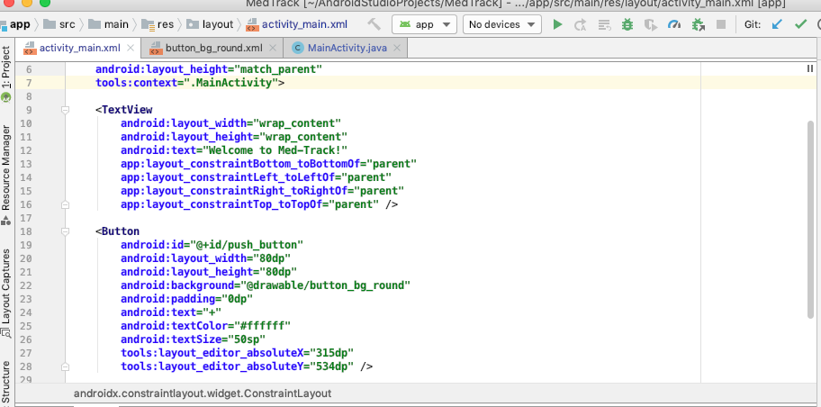
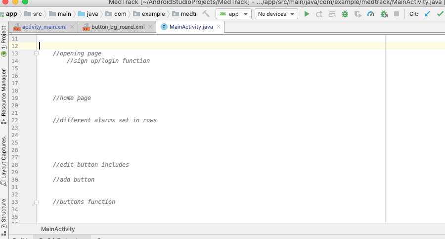

# Entry 4
##### 2/08/20

<h3>What are you using to learn?</h3>
<!--Uses (and links to) multiple sources effectively, where applicable.-->

We didn't need to look up too much external stuff to learn off of recently the main problem we were having was the fact that when I had the computer I had forgotten to pull when we ahd edited the code in our IDE so that's all that needs fixing as of right now but that doesn't need research.
In order to create the button that we need in order for our users to add alarms Nadia had been doing some research on how to go about writing that piece of code while Elizabeth assisted her and I wrote the comments so we know where to write certain lines of code included in our pseudocode.
I wasn't paying too much attention to where and what they were researching but when Nadia had stumbled across this website <a href="https://developer.android.com/guide/topics/ui/controls/button#java">which told her how to add the button for our app</a>.
Then we began to do some research on the colors we might want for the button.
The default was blue but honestly when we think blue we don't think medicine so as a group we decided that red would be a better color.
We had used <a href="https://coolors.co/">a website</a>  which showed us a wide variety of red until we finally landed on the two reds we wanted for the border and inside of the button.

  

<h3>Where are you at in the process of your product? </h3>

<!--//Effectively considers current stage in EDP, plans for next stage.
Must state “engineering design process.”-->

 In our engineering design proccess I'm happy to state that we have finally begun to actually code in Android Studio as well as in our shared IDE.
For me personally I want to say our biggest success as a group was figuring out how to connect Android Studio and our MedTrack file in our IDE to one github repository.
With this now we'll all be able to make edits from our IDE with our respective computers because only the laptop we borrowed from the school actually contains the app Android Studio.
This overall is extremely helpful because in order to actually push our changes we have to do commits which helps us keep track of what we're doing.
Although this is very helpful this means we will have to continue to push our communication skills because if we work on the same line of code we'll get an error which we don't neccessarily want.

<h3>What are you learning in class that applies directly to your project?
</h3>
<!--
Displays knowledge gained that applies to this entry, where applicable.-->

In class it's been emphasized how important it is to take notes because we won't remember everything.
I feel like this is especially true for me because I frequently forget what I learn even when it's recent.
This has helped me realize how important it is to actually keep track of our successes and what we do on a weekly basis.
While it's not always all of us that write down the notes its helpful when one of our groupmates writes down our progress.
It helps us keep track of what we have done and what actually needs to be done.

<h3>How are you developing in ways that apply outside of your project?</h3>

<!--Reflects on at least two skills developed since the previous entry.-->
<!--Must state “skill/skills.”-->

Since my previous entry I can say that as a group we've improved our ability to google and research things better.
Android studio is basically unexplored territory so it's important that we actually do our own research and LOYO.
Through this we were able to find large chunks of code that we actually need to make our MVP come true.
Furthermore another skill we've been improving on is paying attention to detail.
ALthough that's not entirely important to reach our MVP we still need to make sure that our app looks professonial and nice overall.

[Previous](entry02.md) | [Next](entry04.md)

[Home](../README.md)

[Previous](entry03.md) | [Next](entry05.md)

[Home](../README.md)